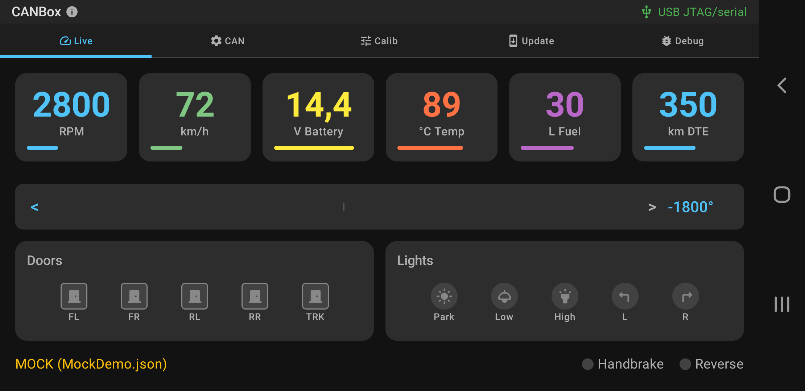
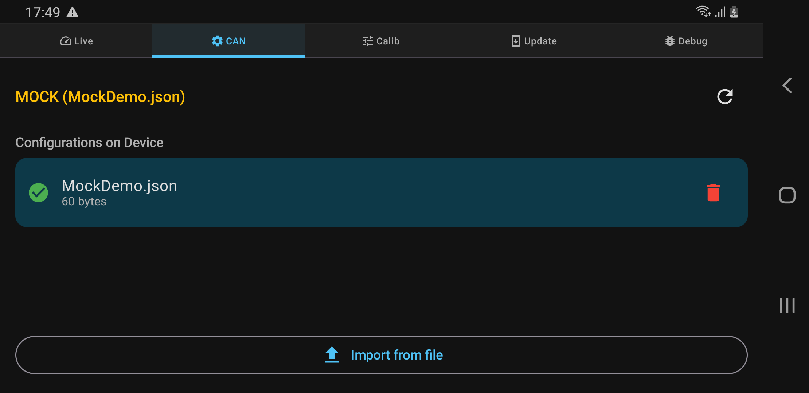
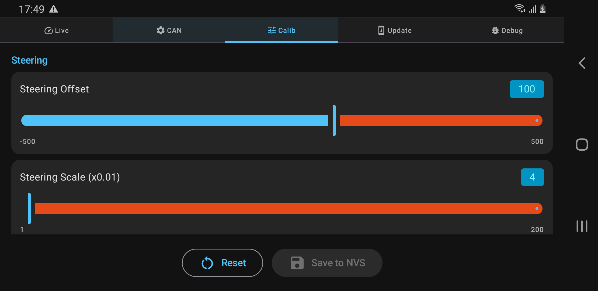
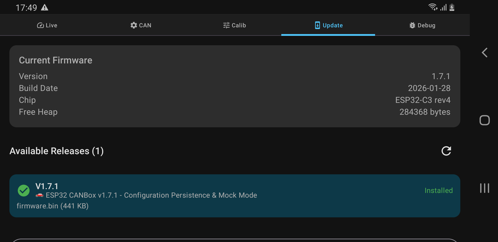

# ESP32 CANBox Manager

Android companion app for configuring and monitoring the ESP32 CANBox (Nissan Juke F15 CAN bridge).

## Screenshots

| Live Dashboard | CAN Config |
|:-:|:-:|
|  |  |

| Calibration | Firmware Update |
|:-:|:-:|
|  |  |

## Features

- **Live Dashboard** - Real-time vehicle data (RPM, speed, voltage, temperature, fuel, steering angle, doors, lights)
- **CAN Config** - Manage vehicle configuration files on the ESP32
- **Calibration** - Adjust calibration parameters (steering offset/scale, RPM divisor, tank capacity, etc.)
- **Firmware Update** - OTA updates via USB serial with GitHub releases integration
- **Debug Console** - Send commands and view ESP32 responses
- **Auto Update Check** - Notifies when app or firmware updates are available

## Requirements

- Android device with USB OTG support
- Android 7.0+ (API 24)
- ESP32 CANBox running [esp32-canbox-nissan](https://github.com/aerodomigue/esp32-canbox-nissan) firmware

## Target Device

Optimized for 1280x720 landscape displays (Android head units).

## USB Communication

The app communicates with the ESP32 via USB CDC serial (115200 baud) using AT-style commands:

| Command | Description |
|---------|-------------|
| `SYS INFO` | Get firmware version and system info |
| `SYS DATA` | Get live vehicle data |
| `CFG LIST/GET/SET/SAVE` | Calibration parameters (NVS) |
| `CAN STATUS/LIST/LOAD/DELETE` | Vehicle config files (LittleFS) |
| `LOG ON/OFF` | CAN frame debug logging |
| `OTA START/DATA/END` | Firmware update (base64) |

## Building

```bash
# Clone
git clone https://github.com/aerodomigue/esp32-canbox-manager.git
cd esp32-canbox-manager

# Build debug APK
./gradlew assembleDebug

# APK location
app/build/outputs/apk/debug/app-debug.apk
```

## Tech Stack

- Kotlin
- Jetpack Compose + Material Design 3
- Navigation Compose
- Koin (Dependency Injection)
- usb-serial-for-android
- Retrofit (GitHub API)

## License

MIT License - see [LICENSE](LICENSE)

## Author

**aerodomigue** - [GitHub](https://github.com/aerodomigue)

## Related Projects

- [esp32-canbox-nissan](https://github.com/aerodomigue/esp32-canbox-nissan) - ESP32 firmware
